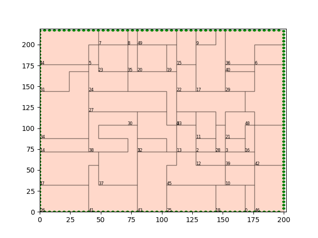
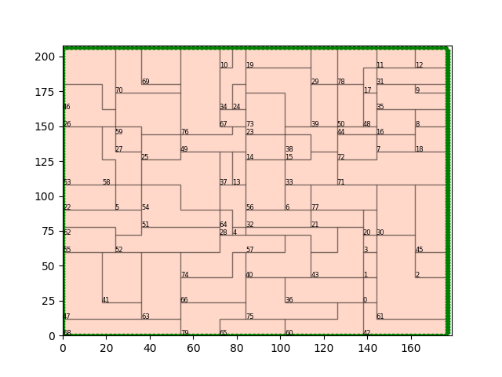

# FloorSet - a VLSI Floorplanning Dataset with Design Constraints of Real-World SoCs

## Overview 

FloorSet is a dataset that contains 2 MILLION floorplan benchmark circuits. These circuits reflect real-world constraints and objectives of the Floorplanning problem at SoC and sub-system hierarchies, which is a crucial component of the physical design flow. This dataset contains synthetic fixed-outline floorplan layouts in PyTorch tensor format.

FloorSet is composed of two datasets:
1. **FloorSet-Prime** (1M layouts)
2. **FloorSet-Lite** (1M layouts)

*Each dataset includes 1M training samples and 100 test samples, with hard constraints seen in modern design flows such as shape constraints, boundary constraints, grouping constraints, multi-instantiation blocks, fixed and pre-placement constraints.* 

FloorSet is intended to spur fundamental research on large-scale constrained optimization problems and alleviates the core issue of reproducibility in modern ML-driven solutions to such problems. FloorSet has the potential to be “the Floorplanning” benchmark for the academic research community and can speed up research in this domain. All data in FloorSet is synthetically generated based on an algorithm designed by us, with no external input.


<p align="center">
  
</p>

|  <br> An example FloorSet-Prime layout with 21 partitions |  <br> An example FloorSet-Prime layout with 50 partitions |
|:---------------------------------------------------------------------------------:|:---------------------------------------------------------------------------------:|
|  <br> An example FloorSet-Prime layout with 80 partitions |  <br> An example FloorSet-Prime layout with 120 partitions |


**We're putting the finishing touches on the code. Stay tuned for an update here.**

## Citation

If you utilize this dataset for training machine learning models or validating floorplanning algorithms, we would appreciate it if you cite our work (https://arxiv.org/abs/2405.05480) [Accepted in ICCAD 2024].

```
@misc{mallappa2024floorsetvlsifloorplanning,
      title={FloorSet -- a VLSI Floorplanning Dataset with Design Constraints of Real-World SoCs}, 
      author={Uday Mallappa and Hesham Mostafa and Mikhail Galkin and Mariano Phielipp and Somdeb Majumdar},
      year={2024},
      eprint={2405.05480},
      archivePrefix={arXiv},
      primaryClass={cs.AR},
      url={https://arxiv.org/abs/2405.05480}, 
}
```

## License

This repository is released under the Apache-2.0 license. The license can be found in the LICENSE file. The dataset (https://huggingface.co/datasets/IntelLabs/FloorSet) is licensed under the Creative Commons Attribution 4.0 International License (CC BY 4.0). 

## Contact

For any questions on the dataset, please email us:.

```
Uday Mallappa: uday.mallappa@intel.com

Hesham Mostafa: hesham.mostafa@intel.com
```