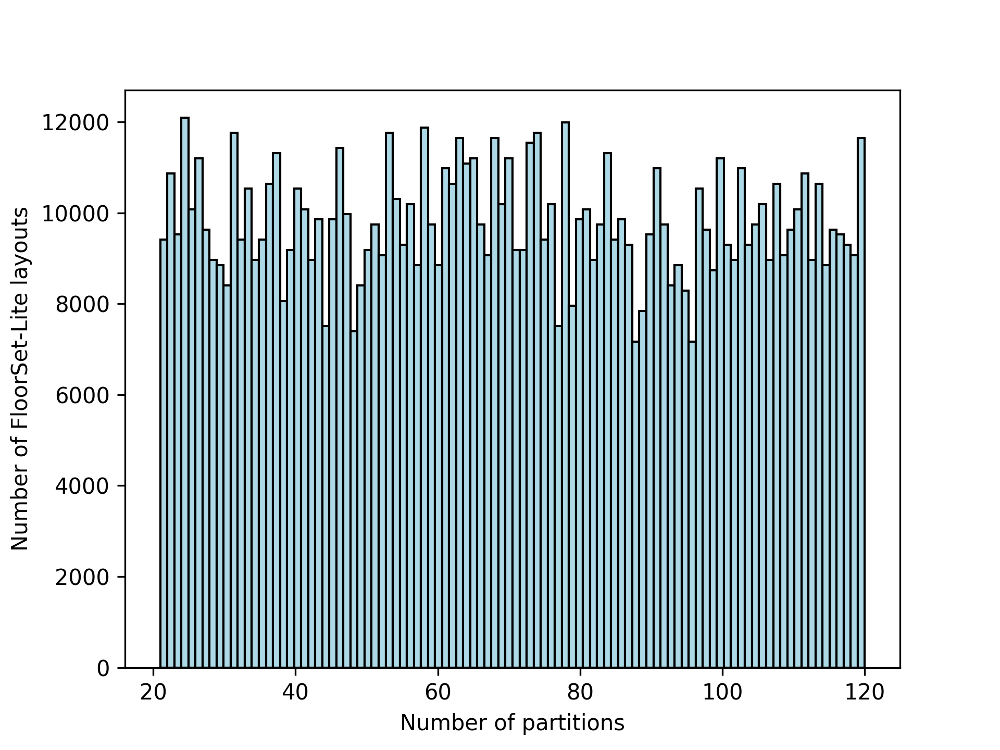
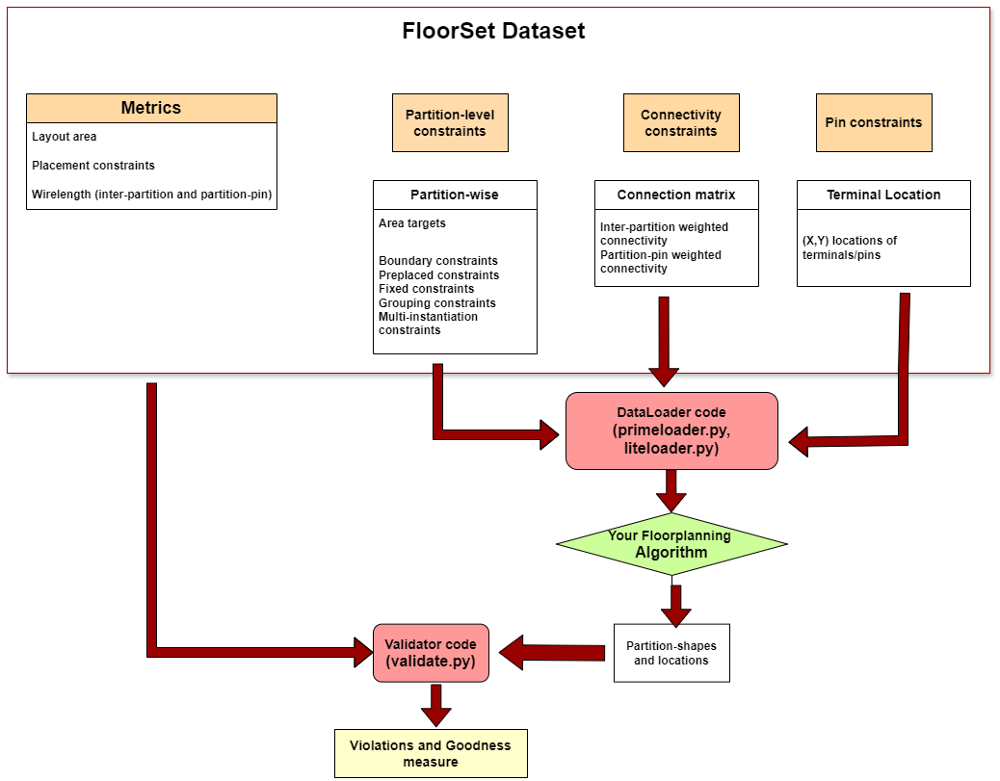

# FloorSet - a VLSI Floorplanning Dataset with Design Constraints of Real-World SoCs

## Overview 

FloorSet contains 2 MILLION floorplan benchmark circuits. These circuits reflect real-world constraints and objectives of the Floorplanning problem at SoC and sub-system hierarchies, which is a crucial component of the physical design flow. This dataset contains synthetic fixed-outline floorplan layouts in PyTorch tensor format.


<p align="center">
  
</p>


FloorSet is composed of two datasets:
1. **FloorSet-Prime** (1M layouts)
2. **FloorSet-Lite** (1M layouts)

*Each dataset includes 1M training samples, with hard constraints seen in modern design flows such as shape constraints, boundary constraints, grouping constraints, multi-instantiation blocks, fixed and pre-placement constraints. We also propose 100 testcases for the purpose of validating floorplanning algorithms.* 

FloorSet is intended to spur fundamental research on large-scale constrained optimization problems and alleviates the core issue of reproducibility in modern ML-driven solutions to such problems. FloorSet has the potential to be “the Floorplanning” benchmark for the academic research community and can speed up research in this domain. All data in FloorSet is synthetically generated based on an algorithm designed by us, with no external input.


<p align="center">
  
</p>

### Example layouts from FloorSet-Prime dataset
|  <br> An example FloorSet-Prime layout with 21 partitions |  <br> An example FloorSet-Prime layout with 120 partitions |
|:--------------------------------------------------------------------------------------------:|:--------------------------------------------------------------------------------------------:|


### Example layouts from FloorSet-Lite dataset
|  <br> An example FloorSet-Lite layout with 21 partitions |  <br> An example FloorSet-Lite layout with 120 partitions |
|:--------------------------------------------------------------------------------------------:|:--------------------------------------------------------------------------------------------:|


### Layout distribution
|  FloorSet-Prime benchmark distribution |  FloorSet-Lite benchmark distribution |
|:--:|:--:|


## Prerequisites

- **Required Storage for Dataset:** 35 GB.
- **Prime Dataset:** 
  - Approximately 15 GB will be downloaded, expanding to around 25 GB when decompressed.
- **Lite Dataset:** 
  - Approximately 5.1 GB will be downloaded, expanding to around 8.8 GB when decompressed.


- ** Dependencies can be installed using pip:

```sh
pip install -r requirements.txt
```


## Loading the data

To load the dataset, 
1.  **Dataloader codes:** To load the datasets and iterate, use **primeloader.py** and **liteloader.py**. 
(Avoid shuffling by setting shuffle=False in the DataLoader), as it can lead to slower data loading times)
2.  **Validator code:** To report metrics for a floorplan solution, use *estimate_cost* in **validate.py**.
3.  **Wirelength and area calculation code:**   *calculate_weighted_b2b_wirelength, calculate_weighted_p2b_wirelength* in **cost.py** 

### Dataset Format

<p align="center">
  
</p>


#### Inputs:

- **`area_target:`**  
  `batch_size x n_blocks`  
  Area targets for each block.

- **`b2b_connectivity:`**  
  `batch_size x b2b_edges x edge-weight`  
  Block-to-block connectivity.

- **`p2b_connectivity:`**  
  `batch_size x p2b_edges x edge-weight`  
  Pin-to-block connectivity.

- **`pins_pos:`**  
  `batch_size x n_pins x 2`  
  External pins or terminals `(x, y)` locations.

- **`placement_constraints:`**  
  `batch_size x n_blocks x 5`  
  Block-wise placement constraints [fixed, preplaced, multi-instantiation, cluster, boundary]:
  - **Fixed Flag:**  
    0/1: If 1, the shape should match the target polygon shape. Only the target polygon shape (not the location) should be inferred from the solution. Free to translate or rotate the target shape. 
  - **Preplaced Flag:**  
    0/1: If 1, the shape and location should match the target shape. The target polygon shape and location should be inferred from the solution. 
  - **Multi-instantiation Block (MIB):**  
    0 if no constraint, otherwise the index indicates the group ID that shares the shape. Each MIB group indicates instantiations of one master partition.  
    - For example, blocks with index-1 form the first MIB group, and blocks with index-2 form the second MIB group.
  - **Cluster:**  
    0 if no constraint, otherwise the index indicates the group ID that needs to be physically clustered (the union of polygons in the cluster should be one continuous polygon).  
    - For example, blocks with index-1 form the first cluster, and blocks with index-2 form the second cluster.
  - **Boundary:**  
    0 if no constraint.
    - **LEFT:** 1
    - **RIGHT:** 2
    - **TOP:** 4
    - **BOTTOM:** 8
    - **TOP-LEFT:** 5
    - **TOP-RIGHT:** 6
    - **BOTTOM-LEFT:** 9
    - **BOTTOM-RIGHT:** 10

#### Labels:

- **`sol:`**  
  `batch_size x n_blocks x vertices x 2`  
  Polygon shape of each block (target solution) containing a list of polygon vertices for each block.
  (For FloorSet-Lite, it is batch_size x n_blocks x 4, where we provide [w, h, x, y] for each block. In addition, we also provide the corresponding B*Tree representation.)

- **`metrics:`**  
  `[area, num_pins, num_total_nets, num_b2b_nets, num_p2b_nets, num_hardconstraints, b2b_weighted_wl, p2b_weighted_wl]`
  - **area:**  
    Target layout area of the bounding box.
  - **num_pins:**  
    Number of terminals (or pins) in the layout.
  - **num_total_nets:**  
    Total number of nets in the circuit.
  - **num_b2b_nets:**  
    Number of inter-block nets.
  - **num_p2b_nets:**  
    Number of terminal (or pin)-block nets.
  - **num_hardconstraints:**  
    Total number of hard constraints (a block can be part of multiple non-conflicting constraints).
  - **b2b_weighted_wl:**  
    Inter-block weighted wirelength (center-center Manhattan distance of the net * weight of the net).
  - **p2b_weighted_wl:**  
    Pin-block weighted wirelength (center-center Manhattan distance of the net * weight of the net).


## Intel Test Dataset

This repository includes a comprehensive Intel test dataset consisting of **200 static test circuits**—**100 FloorSet-Prime test cases** and **100 FloorSetLite test cases**—in addition to the **2 million training samples**. The purpose of these 200 test circuits is to establish a standard validation protocol that is reproducible.

### Dataset Details

- **Test Cases**: Each test case is annotated with specific placement constraints.
- **Optimal Metrics**: The optimal metrics for each test case are documented in the following files:
  - [`intel_testsuite.md`](./intel_testsuite.md)
  - [`intel_testsuite_lite.md`](./intel_testsuite_lite.md)

### Dataloaders

The dataloaders for these test circuits are implemented in the following Python scripts:
- `primetestLoader.py`
- `litetestLoader.py`

These scripts facilitate the loading and processing of the test circuits for validation purposes.

### Contents

- **Layout Images:** 
  - 100 test case images for validation
  - Partition count in the range of (20, 120]

- **Optimal Metrics and design attributes:** 
  - Found in [`intel_testsuite.md`](#intel_testsuite.md)

- **Test Dataset:** 
  - Located at [`data/PrimeTensorDataTest.tar.gz`](#data/PrimeTensorDataTest.tar.gz)

- **Data Loader:** 
  - Available in [`testLoader.py`](#testdataloader.py)


|  |  |
|:--------------------------------------------------------------------:|:--------------------------------------------------------------------:|
| FloorSet-Prime validation benchmarks, with placements and connectivity constraints                                                  | Corresponding layouts (connectivity and placement constraints removed for better visualization)                                                    |


## Citation

If you utilize this dataset for training machine learning models or validating floorplanning algorithms, we would appreciate it if you cite our work (https://arxiv.org/abs/2405.05480) [Accepted in ICCAD 2024].

```
@misc{mallappa2024floorsetvlsifloorplanning,
      title={FloorSet -- a VLSI Floorplanning Dataset with Design Constraints of Real-World SoCs}, 
      author={Uday Mallappa and Hesham Mostafa and Mikhail Galkin and Mariano Phielipp and Somdeb Majumdar},
      year={2024},
      eprint={2405.05480},
      archivePrefix={arXiv},
      primaryClass={cs.AR},
      url={https://arxiv.org/abs/2405.05480}, 
}
```

## License

This repository is released under the Apache-2.0 license. The license can be found in the LICENSE file. The dataset (https://huggingface.co/datasets/IntelLabs/FloorSet) is licensed under the Creative Commons Attribution 4.0 International License (CC BY 4.0). 

## Contact

For any questions on the dataset, please email us:.

```
Uday Mallappa: uday.mallappa@intel.com
Hesham Mostafa: hesham.mostafa@intel.com
```
